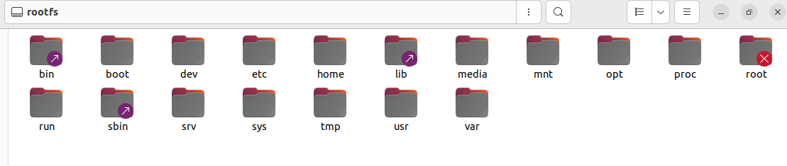
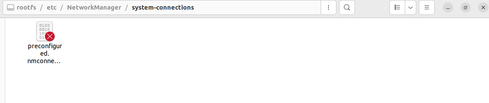
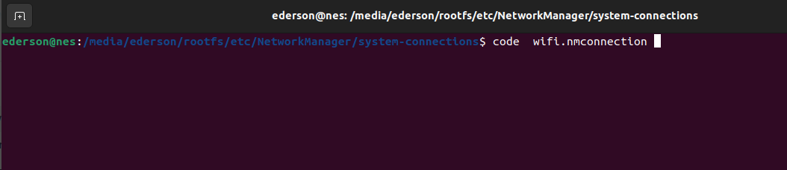

### How to change Network in a RPI5  (already burned)

1. Reading  and changing config SD card config

When read the RPI5 SD card is identified as `"rootfs"`:

2. Go to this folder
   `/etc/NetworkManager/system-connections/`

3. Open this folder in terminal and creates a file named `wifi.nmconnection`

