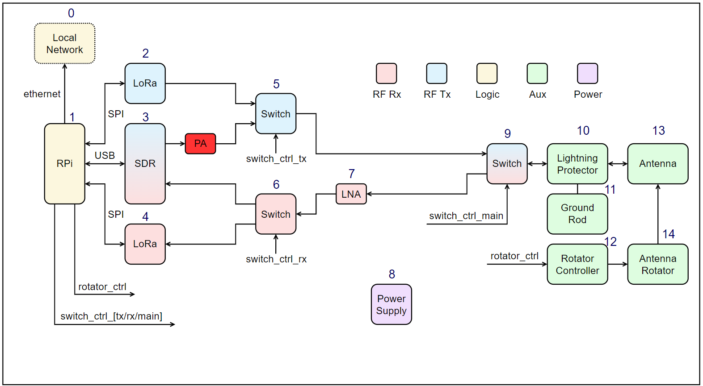
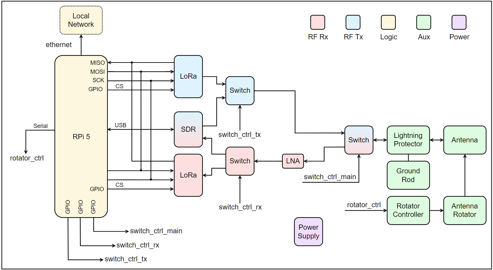
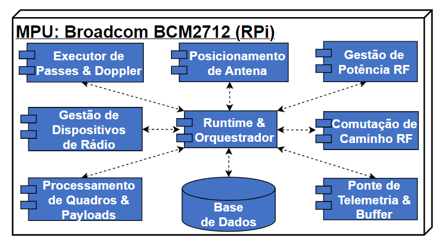
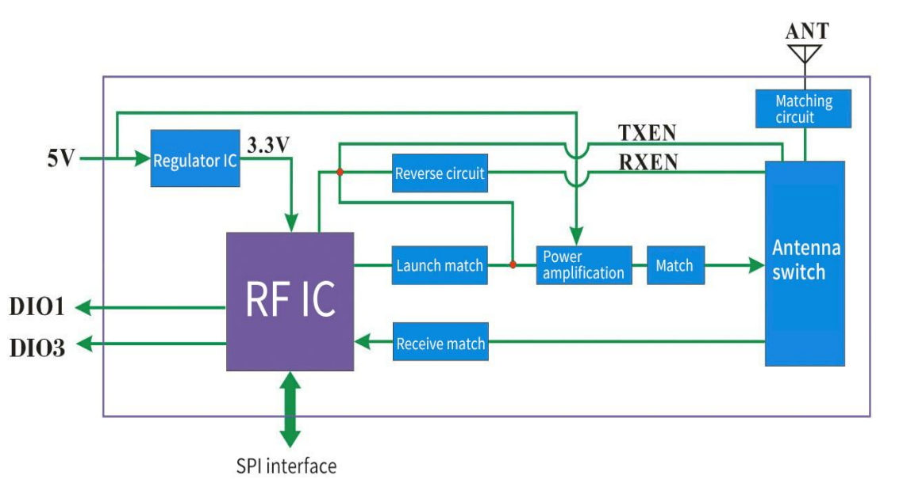
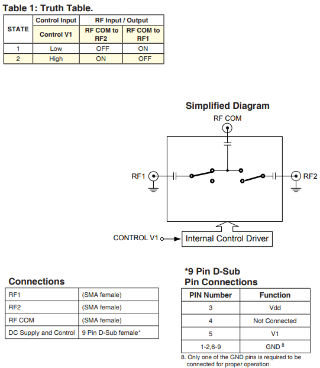
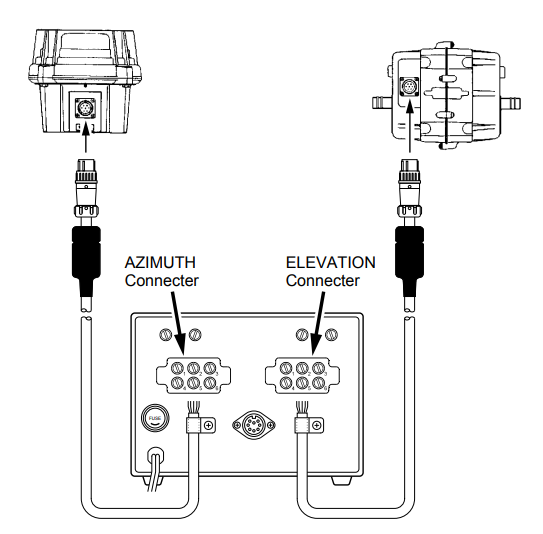
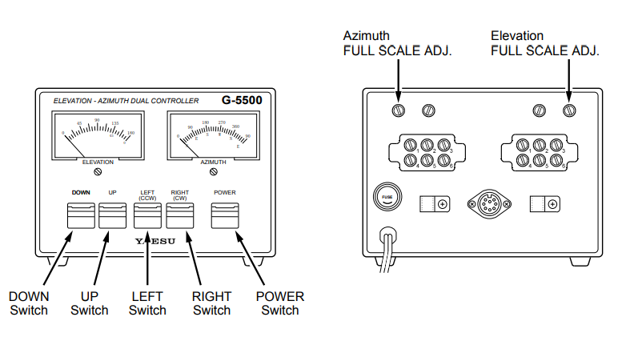

## Diagrama de Blocos da GS

### 0 : Local Network
### 1 : RPI 5 

- **Executor de Passes e Doppler**: implementa predição de passagens via software (Gpredict) - aplicativo no qual se armazena o TLE dos sats. Doppler não foi previsto aplicar, porém pode ser algo interessante  a adicionar,  (Gpredict também faz o cálculo).
- **Gestão de dispositivos de Radio**: software para conectar via SPI o transmissor e receptor LoRa,  LoRa Tx e LoRa Rx (2 e 4). Programação em C. Este programa é usado para gerenciar a recepção e o envio de Telecomandos repassados ao rádios (2,4). No caso do SDR (3) o dispositivo é conectado via USB,  a programação pode ser feita em python usando as versões dos arquivos gerados ao rodar um flowgraph no GNU Radio (quando um programa é gerado no GNU Radio automaticamente sua versão python é criada), com o uso de variáveis externas  para configuração, se necessário. 
- **Processamento de Quadros & Payload**: códigos especiais para decodificação de pacotes de payload contido nas mensagens. O número de programas depende do número de satélites a decodificar (O que seria processamento de quadros?).
- **Posicionamento da Antena** dois softwares principais são usados para controle da antena: Gpredict (https://oz9aec.dk/gpredict/), que é utilizado também para fazer predicões de passadas de satélites, e para o controlador externo GS232B da Yaesu, software para controle da antena via daemon (programa  que roda em segundo plano) *rotclt* (https://hamlib.sourceforge.net/html/rotctld.1.html) que atualiza os dados de posicionamento através através de conexão TCP. 
- **Runtime & orchestrador**: é a representação do core central que gerencia os outros programas.
- **Base de Dados** utilizado para armazenamento de dados de pacotes recebidos dos satélites.
- **Gestão de Potência de RF**: controla a potência do sinal a ser transmitido. A gestão de potência pode ser incluido no programa de **Gestão de dispositivos de rádio** para simplificação. 
- **Comutação do Caminho de RF** através das saídas GPIO o fluxo de transmissão ou recepção é ativado. Este controle também permite controlar a ativação do SDR ou dos módulos LoRa para transmissão ou recepção. 
- **Ponte de telemetria e Buffer**: ponte de telemetria refere-se aos comandos de telemetria enviados aos sats (pode ser incluido no **programa de Gestão de dispositivos de Radio**)

### 2 e 4 - LoRa Tx e Rx

- LoRa [1268F30 Gnice RF]([file:///C:/Users/eders/Downloads/LoRa126XF30%202W%20High%20power%20Wireless%20Transceiver%20Module%20V2.4.pdf](https://www.nicerf.com/lora-module/sx1268-wireless-module-lora1268f30.html)) e [E22-400M33S Ebyte](https://www.cdebyte.com/pdf-down.aspx?id=3667).  
- Ambos baseados no chip [SX1268 da semtech](https://semtech.my.salesforce.com/sfc/p/#E0000000JelG/a/RQ000008nGa9/v.ea8jp.cso4PrL7koonfOfzpF4krk_NglUXEPVQRzg)

Basicamente possuem um chip 1268 e amplificadores adicionais e baluns para RF.

- 1268F30 diagrama interno 

### 5,6 e 9 Switch

É utilizado o switch de RF [ZSW2-63DR+](https://www.minicircuits.com/pdfs/ZSW2-63DR+.pdf) com ativação em 3v3. 

### 14 Antenna Rotator

Rotor [GS-5500DC](https://static.dxengineering.com/global/images/instructions/ysu-g-5500dc_xb.pdf) da YAESU 

Conectado ao rotor através de cabo 8 Pin DIN 

### 12 Rotator Controller 

ROTOR controller [GS-232B](https://www.passion-radio.com/index.php?controller=attachment&id_attachment=782&srsltid=AfmBOoqnKOPOLc3T2nysHCcl0v3-MBkX_HvJNAdfxjHIFe8_Hdlq7G1H) YAESU [schematic](https://www.manualslib.com/manual/1000473/Yaesu-Gs-232b.html?page=23)

