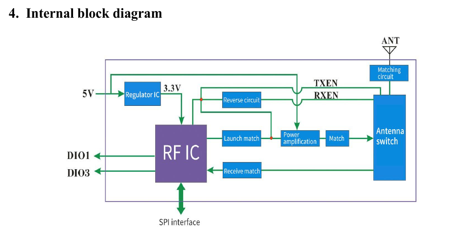
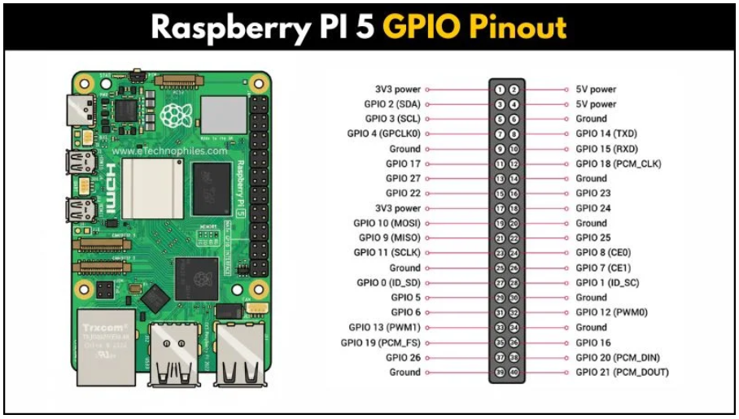
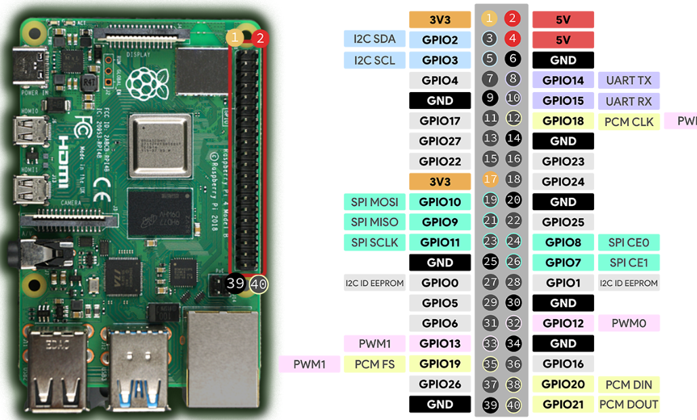
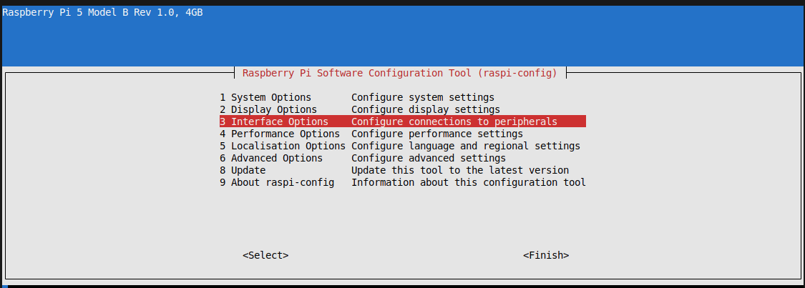
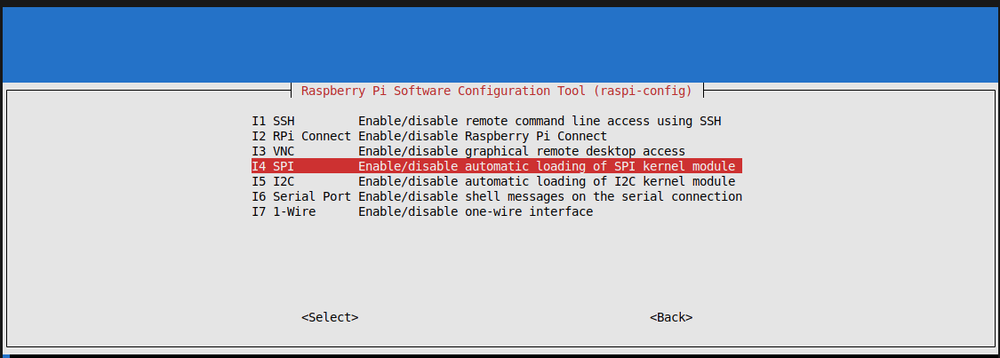
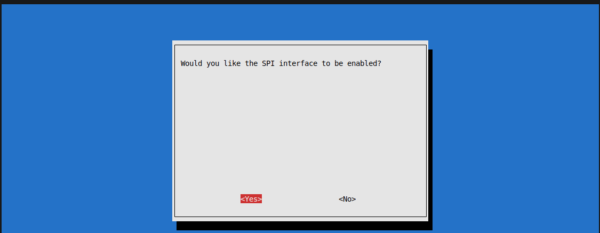

# LoRa module 1268F30-433 install

The objective of this project is to enable the SPI communication of G-Nice RF 1268F30-433 MHz module with the Raspbery Pi 5, as seen in the Fig.1:


<p align="center">

</p>

<p align="center"><em>Fig. 1. aaaa </em></p>

## Connections
In accordance with the 1268F30 manual the SPI has an internal regulator to 3V3 operation:

<p align="center">

</p>

The RPI 5 has 2 common ways to refer to the pins:
- Board numbering: use the physical positions of the header
- BCM numbering: 


## Master modes
Signal name abbreviations:

- SCLK
serial clock

- CE
chip enable (often called chip select)

- MOSI
master out slave in

- MISO
master in slave out

- MOMI
master out master in

## Standard mode
In Standard SPI mode the peripheral implements the standard three-wire serial protocol (SCLK, MOSI and MISO).

## Bidirectional mode
In bidirectional SPI mode the same SPI standard is implemented, except that a single wire is used for data (MOMI) instead of the two used in standard mode (MISO and MOSI). In this mode, the MOSI pin serves as MOMI pin.


<p align="center">

</p>

[source Fig](https://www.etechnophiles.com/raspberry-pi-5-gpio-pinout/)  

<p align="center">

</p>


References:   
[1268F30 manuals page](https://www.nicerf.com/lora-module/'sx1268-wireless-module-lora1268f30.html)


# Set up RPI-5 to use SPI

## STEP 1 - Installing OS + saving SDmicro card


## STEP 2 - Recovering IP and MAC from a known network

Problem: I've installed the RPI with a known WiFi network, but I don't remember the IP to access it via SSH. I would also discover the MAC to be registered for another network, just in case. 

2.1 Install nmap to network scan

```bash
sudo snap install nmap
```

2.2 Scan the network from host numbers for 0 to 254  

I already know that the network prefix  is 192.168.100, and each IP is a number 192.168.100.x where x is the host identifier, so I search from x=1 to x=254, 24 bits for network and 8 bits to host idn, with following command:   


```bash
nmap -sn  192.168.100.0/24  
```

and found a line containing:  

```bash
Nmap scan report for raspberrypi.lan (192.168.100.183)
```

So I supposed it is my RPI IP, because when I disconnect it this IP disappear.


2.3 SSH access  

Password: lacom

```bash
ssh pi@192.168.100.183
```
```bash
ssh pi@192.168.100.183
pi@192.168.100.183's password: 
Linux raspberrypi 6.12.47+rpt-rpi-2712 #1 SMP PREEMPT Debian 1:6.12.47-1+rpt1 (2025-09-16) aarch64

The programs included with the Debian GNU/Linux system are free software;
the exact distribution terms for each program are described in the
individual files in /usr/share/doc/*/copyright.

Debian GNU/Linux comes with ABSOLUTELY NO WARRANTY, to the extent
permitted by applicable law.
Last login: Wed Oct  8 14:49:32 2025 from 192.168.100.114
-bash: warning: setlocale: LC_CTYPE: cannot change locale (pt_BR.UTF-8): No such file or directory
-bash: warning: setlocale: LC_CTYPE: cannot change locale (pt_BR.UTF-8): No such file or directory
-bash: warning: setlocale: LC_CTYPE: cannot change locale (pt_BR.UTF-8): No such file or directory
-bash: warning: setlocale: LC_CTYPE: cannot change locale (pt_BR.UTF-8): No such file or directory
-bash: warning: setlocale: LC_CTYPE: cannot change locale (pt_BR.UTF-8): No such file or directory
-bash: warning: setlocale: LC_CTYPE: cannot change locale (pt_BR.UTF-8): No such file or directory
-bash: warning: setlocale: LC_CTYPE: cannot change locale (pt_BR.UTF-8): No such file or directory
-bash: warning: setlocale: LC_CTYPE: cannot change locale (pt_BR.UTF-8): No such file or directory
pi@raspberrypi:~ $ 
```


2.4 Discovering MAC

with command: 

```bash
ip addr
```


```bash 
pi@raspberrypi:~ $ ip addr
1: lo: <LOOPBACK,UP,LOWER_UP> mtu 65536 qdisc noqueue state UNKNOWN group default qlen 1000
    link/loopback 00:00:00:00:00:00 brd 00:00:00:00:00:00
    inet 127.0.0.1/8 scope host lo
       valid_lft forever preferred_lft forever
    inet6 ::1/128 scope host noprefixroute 
       valid_lft forever preferred_lft forever
2: eth0: <NO-CARRIER,BROADCAST,MULTICAST,UP> mtu 1500 qdisc fq_codel state DOWN group default qlen 1000
    link/ether 2c:cf:67:24:83:29 brd ff:ff:ff:ff:ff:ff
3: wlan0: <BROADCAST,MULTICAST,UP,LOWER_UP> mtu 1500 qdisc fq_codel state UP group default qlen 1000
    link/ether 2c:cf:67:24:83:2a brd ff:ff:ff:ff:ff:ff
    inet 192.168.100.183/24 brd 192.168.100.255 scope global dynamic noprefixroute wlan0
       valid_lft 43043sec preferred_lft 43043sec
    inet6 fe80::795e:1bb2:2d86:c345/64 scope link noprefixroute 
       valid_lft forever preferred_lft forever
```
Then: 


|interface| MAC|
|:-:|:-:|
| eth0| 2c:cf:67:24:83:29 | 
| wlan0 | 2c:cf:67:24:83:2a | 


## STEP 3  See if SPI is enabled

We could see if the SPI is enable (could be disable by default) by using the command:

```bash
pi@raspberrypi:~ $ ls /dev/spidev*
/dev/spidev10.0
```


In the case we see an extra SPI inteface active bus/SPI controller 10, CS0, but we search for  
/dev/spidev0.0  /dev/spidev0.1 (bus/SPI controler 0 and CS0 or CS1). So we can active it using the command 

```bash 
sudo raspi-config
```
It opens an interface, where whe go to the "`3. Interface Options...`"

<p align="center">

</p>


and enable automatic loading SPI kernel module : 

<p align="center">

</p>

<p align="center">

</p>


Thus,  after go out of the interface,  we check the SPI again:

```bash
pi@raspberrypi:~ $ ls /dev/spidev*
/dev/spidev0.0  /dev/spidev0.1  /dev/spidev10.0
```

Now bus 0, CS=0 and CS=1 are activated.


### CODIGO

```c++

#include <RadioLib.h>

// CS, DIO1, RESET, BUSY
SX1268 radio = new Module(
  8,      // NSS / CS (SPI0 CE0)
  22,     // DIO1
  27,     // RESET (NRESET)
  17      // BUSY
);

void setup() {
  Serial.begin(115200);

  int state = radio.begin(433.0);  // ajuste frequência (433/868/915)

  if(state == RADIOLIB_ERR_NONE) {
    Serial.println("LoRa iniciado com sucesso!");
  } else {
    Serial.print("Erro ao iniciar LoRa: ");
    Serial.println(state);
  }
}

void loop() {
  radio.transmit("Hello LoRa Raspberry Pi");
  delay(2000);
}

```


| LoRa RF1268F30 | Raspberry Pi 5 (GPIO) |
|---|---|
| VCC | 3.3V ou 5V (dependendo do módulo) |
| GND | GND |
| SCK | GPIO11 |
| MISO | GPIO9 |
| MOSI | GPIO10 |
| NSS (CS) | GPIO8 |
| DIO1 | GPIO22 |
| RESET | GPIO27 |
| BUSY | GPIO17 |