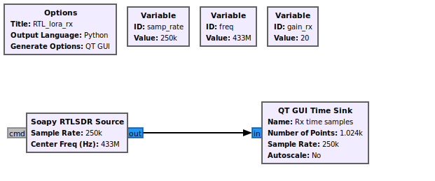
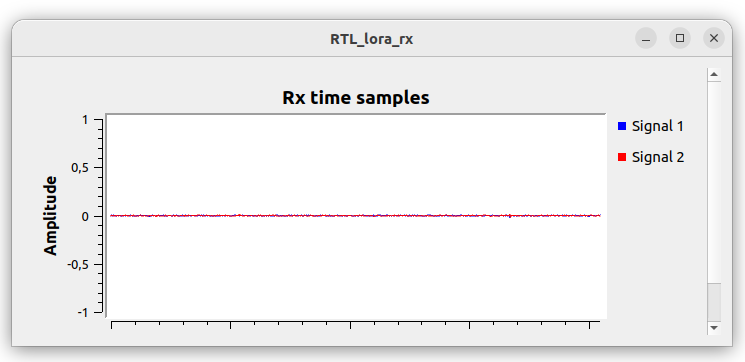
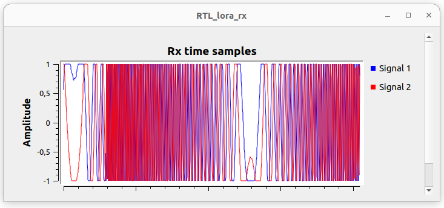

### Transmition Test 

Once basicTest has successfuly run, we will advance in a transmission test. In this case, the RPI-5 will transmit same LoRa packets and we will see if a RTL-SDR v3 could detect the packet.


PIN map 


| LoRa RF1268F30 | Raspberry Pi 5 (GPIO) |
|---|---|
| VCC | 3.3V  (pin 17)|
| GND | GND (pin 9) |
| SCK | GPIO11 |
| MISO | GPIO9 |
| MOSI | GPIO10 |
| NSS (CS) | GPIO5 |
| DIO1 | GPIO22 |
| RESET | GPIO27 |
| BUSY | GPIO17 |


code for RPI

```c++

#include <RadioLib.h>
#include <PiHal.h>
#include <iostream>

PiHal* hal = new PiHal(0);

// NSS(GPIO5), DIO1(GPIO22), RESET(GPIO27), BUSY(GPIO17)
SX1268 radio = new Module(hal, 5, 22, 27, 17);

int main() {

    std::cout << "Initializing SX1268..." << std::endl;

    int state = radio.begin(
        434.0, // freq
        125.0, // bw
        9,  // SF
        7,  // CR
        0x12, // Sync Word
        10, // output power (dBm)
        8   // preamble len
    );

    if(state != RADIOLIB_ERR_NONE) {
        std::cout << "Initialization failed: " << state << std::endl;
        return 1;
    }

    std::cout << "Radio initialized successfully!" << std::endl;

    // Message to transmit
    std::string message = "Hello Hello Nes";

    std::cout << "Transmitting: " << message << std::endl;

    // Send message
    state = radio.transmit(message.c_str());

    if(state == RADIOLIB_ERR_NONE) {
        std::cout << "Message transmitted successfully!" << std::endl;
    } else {
        std::cout << "Transmission failed: " << state << std::endl;
    }

    return 0;
}

```


result after compile & run


```bash
pi@raspberrypi:~/Desktop/lora_module_1268F30_comm/transmitTest $ sudo ./transmitTest 
Initializing SX1268...
Radio initialized successfully!
Transmitting: Hello Hello Nes
Message transmitted successfully!
pi@raspberrypi:~/Desktop/lora_module_1268F30_comm/transmitTest $ 
```


### Verifying Result

We use the following flowgraph, called `RTL_lora_rx`, to receive with a RTL-SDR v3 in the host computer

<p align="center">

</p>


### Running GNU Radio flowgraph  without sending data from RPI+1268F30:

<p align="center">

</p>


### Running GNU Radio flowgraph  sending data from RPI+1268F30:

<p align="center">

</p>


# Conclusion

As seen in last figure, the RPI+1268F30 module had successfully transmitted the packet